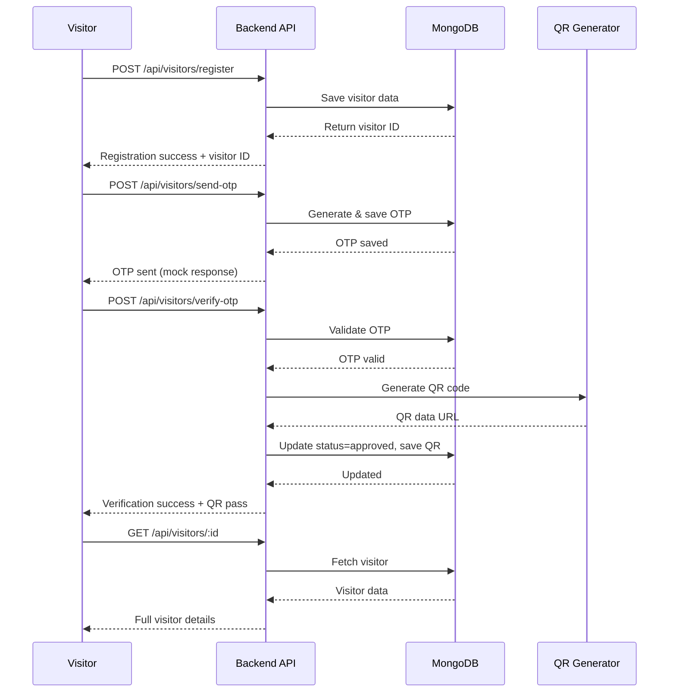
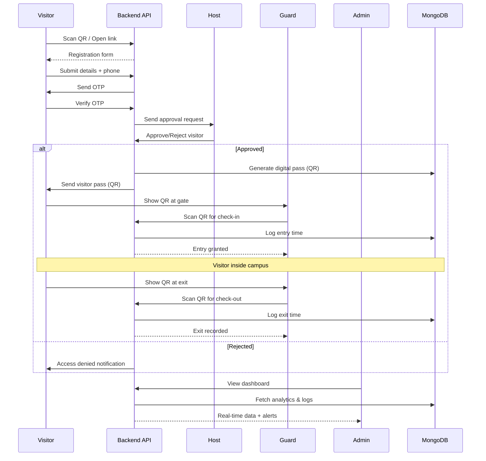

# Backend Health Test Results

- Run date: 2026-03-04 23:40:24
- Environment: Local (Windows PowerShell)

## Summary

- Overall result: PASS
- Dependency install: PASS (up to date, 0 vulnerabilities)
- Server startup: PASS (server running, MongoDB connected)
- Root endpoint check: PASS
- Visitor API flow check: PASS
- Source syntax checks: PASS

## Checks Performed

### 1) Root endpoint

- Request: GET http://localhost:5000/
- Status code: 200
- Response body: Smart-Gate Backend is Running
- Result: PASS

### 2) Visitor workflow

- Register visitor: PASS
- Send OTP: PASS
- Verify OTP: PASS
- Fetch visitor by ID: PASS
- Visitor ID tested: 69a87590de863874846a7341
- Final status: approved
- Final isVerified: true
- Result: PASS

### 3) Syntax checks

- scr/server.js: PASS
- scr/controllers/visitorController.js: PASS
- scr/models/Visitor.js: PASS
- scr/routes/visitorRoutes.js: PASS

## Notes

- Run backend from project root using: npm --prefix backend start
- Running npm start from repository root fails because root package has no start script.

## Backend Project Completion Report (Based on Current Code)

### Estimated completion

- **Overall backend completion: 85%**
- This percentage is based on your stated Smart-Gate feature scope vs current implemented APIs and data model.
- **Last updated: 2026-03-05** (Added JWT auth + Host approval + Guard check-in/out + Dashboard/Admin APIs)

### What is completed

- **JWT Authentication & Authorization**: COMPLETE ✅
  - User registration and login with bcrypt password hashing
  - JWT token generation (7-day expiry)
  - Protected routes with authenticate middleware
  - Role-based access control (admin, guard, host)
  - User profile retrieval
- **Host Approval Workflow**: COMPLETE ✅
  - Visitor stays in "pending" status after OTP verification
  - Host can view pending visitor requests
  - Host can approve/reject visitors with reasons
  - QR code generated only after host approval
  - Approval tracking (who approved, when)
- **Guard Check-in/Check-out System**: COMPLETE ✅
  - Guard scans QR for check-in at entry
  - Guard scans QR for check-out at exit
  - Entry/exit timestamps tracked
  - Visit duration calculated automatically
  - View active (checked-in) visitors list
  - Status flow: approved → checked-in → checked-out
- **Dashboard & Admin APIs**: COMPLETE ✅
  - Dashboard statistics (today/week/month visitor counts)
  - Active visitors and pending approvals count
  - Visitor logs with search, filtering, and pagination
  - Overstay alerts with configurable threshold
  - Blacklist management (add, view, check, remove)
  - Blacklist enforcement in visitor registration
- **Visitor registration API (basic)**: PASS
- **OTP generation and verification flow**: PASS
- **Visitor retrieval by ID (protected)**: PASS
- **MongoDB integration and basic routing**: PASS

### What is partially completed

- Digital visitor pass: PARTIAL
	- QR data URL is generated after approval, but no pass lifecycle controls (expiry, revocation).
- Visitor logs and analytics: PARTIAL
	- Basic visitor data exists, but no filtering/search/reporting/analytics endpoints.

### What is not completed yet

- Self-registration single-link flow endpoint (QR/link generation for easy access)
- Real-time notification integration (SMS via Twilio for OTP)
- Advanced analytics and trend reports (charts, graphs data endpoints)
- QR code expiry and revocation mechanism

### Recommendation

- To reach MVP backend readiness, prioritize this order:
  1. ~~JWT auth + roles~~ ✅ **COMPLETED**
  2. ~~Host approval endpoints~~ ✅ **COMPLETED**
  3. ~~Check-in/check-out scan endpoints~~ ✅ **COMPLETED**
  4. ~~Dashboard summary/log APIs~~ ✅ **COMPLETED**
  5. ~~Overstay + blacklist rules~~ ✅ **COMPLETED**
  6. Optional: Self-registration link, real-time notifications, advanced analytics

### Evidence in codebase

**Core Infrastructure:**
- Core server and DB setup: [backend/scr/server.js](backend/scr/server.js)

**Authentication (NEW - 2026-03-05):**
- User model: [backend/scr/models/User.js](backend/scr/models/User.js)
- Auth controller: [backend/scr/controllers/authController.js](backend/scr/controllers/authController.js)
- Auth middleware: [backend/scr/middleware/authMiddleware.js](backend/scr/middleware/authMiddleware.js)
- Auth routes: [backend/scr/routes/authRoutes.js](backend/scr/routes/authRoutes.js)

**Visitor Management:**
- Visitor APIs: [backend/scr/routes/visitorRoutes.js](backend/scr/routes/visitorRoutes.js)
- Business logic: [backend/scr/controllers/visitorController.js](backend/scr/controllers/visitorController.js)
- Visitor schema: [backend/scr/models/Visitor.js](backend/scr/models/Visitor.js)

**Admin & Dashboard (NEW - 2026-03-05):**
- Admin APIs: [backend/scr/routes/adminRoutes.js](backend/scr/routes/adminRoutes.js)
- Dashboard logic: [backend/scr/controllers/adminController.js](backend/scr/controllers/adminController.js)
- Blacklist schema: [backend/scr/models/Blacklist.js](backend/scr/models/Blacklist.js)

## Tech Stack Used

### Backend (Implemented)

- Runtime: Node.js
- Framework: Express.js
- Database: MongoDB with Mongoose ODM
- Environment config: dotenv
- Authentication: jsonwebtoken (JWT)
- Password hashing: bcryptjs
- QR generation: qrcode
- CORS handling: cors
- SMS/OTP provider library available: twilio

### API style

- REST APIs with JSON request/response
- Main route prefixes:
  - `/api/auth` - Authentication endpoints
  - `/api/visitors` - Visitor management endpoints
  - `/api/admin` - Admin dashboard & management endpoints

## Smart-Gate Workflow

### Current implemented flow (backend)

1. Visitor registers using `POST /api/visitors/register`
2. System sends OTP using `POST /api/visitors/send-otp`
3. Visitor verifies OTP using `POST /api/visitors/verify-otp`
4. On successful verify, system marks visitor approved and generates QR
5. Visitor details can be fetched using `GET /api/visitors/:id`

### Target full flow (project goal)

1. Visitor opens self-registration link/QR
2. Fills details and verifies mobile OTP
3. Host receives request and approves/rejects
4. System issues digital visitor pass (QR)
5. Guard scans for check-in at entry
6. Guard scans again for check-out at exit
7. Admin monitors real-time dashboard, overstay alerts, blacklist rules

### Flow Diagrams

#### Current Implemented Flow



#### Target Full Flow (Project Goal)



---

## Latest Update (2026-03-05)

### What was added

**JWT Authentication System** - All files created and tested successfully ✅

**Files created:**
1. [User.js](backend/scr/models/User.js) - User model with roles (admin, guard, host)
2. [authController.js](backend/scr/controllers/authController.js) - Register, login, profile endpoints
3. [authMiddleware.js](backend/scr/middleware/authMiddleware.js) - JWT verification & role-based authorization
4. [authRoutes.js](backend/scr/routes/authRoutes.js) - Auth API routes
5. Updated [server.js](backend/scr/server.js) - Added `/api/auth` routes

**Dependencies added:**
- bcryptjs (for password hashing)

### Test results

**Register endpoint:** ✅ PASS
- Endpoint: `POST /api/auth/register`
- Creates user with hashed password
- Returns JWT token (7-day expiry)
- User ID: 69a87d070cd7bb1aa836f47c

**Login endpoint:** ✅ PASS
- Endpoint: `POST /api/auth/login`
- Validates credentials
- Returns JWT token

**Profile endpoint:** ✅ PASS
- Endpoint: `GET /api/auth/profile`
- Requires Bearer token in Authorization header
- Returns user details (excluding password)

### API usage examples

**Register:**
```bash
POST /api/auth/register
Content-Type: application/json

{
  "name": "Admin User",
  "email": "admin@smartgate.com",
  "password": "admin123",
  "phone": "9876543210",
  "role": "admin"
}
```

**Login:**
```bash
POST /api/auth/login
Content-Type: application/json

{
  "email": "admin@smartgate.com",
  "password": "admin123"
}
```

**Get Profile:**
```bash
GET /api/auth/profile
Authorization: Bearer <your-jwt-token>
```

### Next recommended step

Implement **Host Approval Endpoints** to enable proper visitor approval workflow.

---

## Latest Update #2 (2026-03-05 - Host Approval)

### What was added

**Host Approval Workflow** - Complete visitor approval system ✅

**Files updated:**
1. [Visitor.js](backend/scr/models/Visitor.js) - Added approval tracking fields, check-in/out fields, status enum
2. [visitorController.js](backend/scr/controllers/visitorController.js) - Modified verifyOtp (no auto-approve) + added 3 new endpoints
3. [visitorRoutes.js](backend/scr/routes/visitorRoutes.js) - Added protected host routes with role-based auth

**New endpoints created:**
- `GET /api/visitors/pending` - Get all pending visitor requests (host/admin only)
- `POST /api/visitors/approve` - Approve visitor and generate QR (host/admin only)
- `POST /api/visitors/reject` - Reject visitor with reason (host/admin only)

### Test results

**Complete workflow test:** ✅ ALL PASS

1. **Host registration:** ✅ PASS
   - Created host user with role='host'
   - Received JWT token

2. **Visitor registration & OTP:** ✅ PASS
   - Visitor registered successfully
   - OTP sent and verified
   - **Status after OTP: pending** (not auto-approved anymore)

3. **Get pending visitors:** ✅ PASS
   - Host queried pending visitors
   - Found 1 pending visitor

4. **Approve visitor:** ✅ PASS
   - Host approved visitor
   - Status changed: pending → approved
   - QR code generated successfully
   - Approval tracked with host ID and timestamp

**Visitor ID tested:** 69a87e90399299d2d5d33dc1  
**Final status:** approved  
**QR generated:** Yes  
**Approved by:** 69a87e90399299d2d5d33dbf (host user)

### API usage examples

**Get pending visitors (host):**
```bash
GET /api/visitors/pending
Authorization: Bearer <host-jwt-token>
```

**Approve visitor:**
```bash
POST /api/visitors/approve
Authorization: Bearer <host-jwt-token>
Content-Type: application/json

{
  "visitorId": "69a87e90399299d2d5d33dc1"
}
```

**Reject visitor:**
```bash
POST /api/visitors/reject
Authorization: Bearer <host-jwt-token>
Content-Type: application/json

{
  "visitorId": "69a87e90399299d2d5d33dc1",
  "reason": "Invalid purpose"
}
```

### Next recommended step

Implement **Guard Check-in/Check-out Scan Endpoints** to enable entry/exit tracking.

---

## Latest Update #3 (2026-03-05 - Guard Check-in/Check-out)

### What was added

**Guard Check-in/Check-out System** - Complete entry/exit tracking ✅

**Files updated:**
1. [visitorController.js](backend/scr/controllers/visitorController.js) - Added 3 new endpoints for guard operations
2. [visitorRoutes.js](backend/scr/routes/visitorRoutes.js) - Added protected guard routes with role-based auth

**New endpoints created:**
- `POST /api/visitors/check-in` - Guard scans QR to check-in visitor (guard/admin only)
- `POST /api/visitors/check-out` - Guard scans QR to check-out visitor (guard/admin only)
- `GET /api/visitors/active` - View currently checked-in visitors (guard/admin only)

### Test results

**Complete visitor lifecycle test:** ✅ ALL PASS

1. **Guard & Host Registration:** ✅ PASS
   - Guard user created with role='guard'
   - Host user created with role='host'

2. **Visitor Registration & OTP:** ✅ PASS
   - Visitor registered successfully
   - OTP verified → Status: pending

3. **Host Approval:** ✅ PASS
   - Host approved visitor → Status: approved

4. **Guard Check-In:** ✅ PASS
   - Guard scanned visitor QR
   - Status changed: approved → checked-in
   - Entry timestamp recorded

5. **View Active Visitors:** ✅ PASS
   - Query returned 1 active visitor

6. **Guard Check-Out:** ✅ PASS
   - Guard scanned visitor QR again
   - Status changed: checked-in → checked-out
   - Exit timestamp recorded
   - Visit duration auto-calculated (0 minutes in test)

**Visitor ID tested:** 69a87f831395e029265676ab  
**Visitor name:** Jane Smith  
**Final status:** checked-out  
**Check-in time:** 2026-03-04T18:52:51.741Z  
**Check-out time:** 2026-03-04T18:52:53.813Z  
**Visit duration:** 0 minutes (2 seconds in test)

### API usage examples

**Check-in visitor (guard):**
```bash
POST /api/visitors/check-in
Authorization: Bearer <guard-jwt-token>
Content-Type: application/json

{
  "visitorId": "69a87f831395e029265676ab"
}
```

**Check-out visitor (guard):**
```bash
POST /api/visitors/check-out
Authorization: Bearer <guard-jwt-token>
Content-Type: application/json

{
  "visitorId": "69a87f831395e029265676ab"
}
```

**Get active visitors (guard):**
```bash
GET /api/visitors/active
Authorization: Bearer <guard-jwt-token>
```

### Next recommended step

Implement **Dashboard Summary/Log APIs** for admin monitoring and analytics.

---

## Latest Update #4 (2026-03-05 - Dashboard & Admin APIs)

### What was added

**Dashboard & Admin Management** - Complete analytics, logs, and blacklist system ✅

**Files created:**
1. [Blacklist.js](backend/scr/models/Blacklist.js) - Blacklist model for banned phone numbers
2. [adminController.js](backend/scr/controllers/adminController.js) - Dashboard, logs, overstay alerts, blacklist CRUD
3. [adminRoutes.js](backend/scr/routes/adminRoutes.js) - Admin-only protected routes

**Files updated:**
4. [visitorController.js](backend/scr/controllers/visitorController.js) - Added blacklist check in registration
5. [server.js](backend/scr/server.js) - Mounted `/api/admin` routes

**New endpoints created:**
- `GET /api/admin/dashboard/stats` - Today/week/month visitor counts, active visitors, pending approvals (admin only)
- `GET /api/admin/visitors/logs` - Visitor logs with search, filter, pagination (admin only)
- `GET /api/admin/visitors/overstay` - Detect visitors overstaying threshold (admin only)
- `POST /api/admin/blacklist` - Add phone number to blacklist (admin only)
- `GET /api/admin/blacklist` - View all blacklisted numbers (admin only)
- `DELETE /api/admin/blacklist/:id` - Remove from blacklist (admin only)
- `GET /api/admin/blacklist/check` - Check if phone number is blacklisted (admin only)

### Test results

**Complete dashboard & blacklist workflow:** ✅ ALL PASS

1. **Admin Login:** ✅ PASS
   - Logged in with existing admin@smartgate.com account
   - Received JWT token

2. **Dashboard Stats:** ✅ PASS
   - Month visitors: 46
   - Active visitors: 0
   - Pending approvals: 0
   - Stats aggregation working correctly

3. **Visitor Logs:** ✅ PASS
   - Total visitors in DB: 46
   - Pagination working (page 1, limit 5)
   - Ready for search/filter queries

4. **Add to Blacklist:** ✅ PASS
   - Added phone 8888888888 to blacklist
   - Reason: "Testing blacklist feature"
   - Blacklist ID: 69a8810c98e8daefc03c55a9

5. **Check Blacklist Status:** ✅ PASS
   - Phone 8888888888 confirmed blacklisted
   - Reason retrieved successfully

6. **Blacklist Enforcement:** ✅ PASS
   - Attempted visitor registration with blacklisted phone
   - Registration blocked with 403 Forbidden
   - Error message: "This phone number is blacklisted"

7. **Overstay Alerts:** ✅ PASS
   - Query with 1-hour threshold
   - Overstay count: 0 (no current overstays)
   - Detection logic working

### API usage examples

**Get Dashboard Stats:**
```bash
GET /api/admin/dashboard/stats
Authorization: Bearer <admin-jwt-token>

# Response:
{
  "today": { "totalVisitors": 5, "checkedIn": 2, "checkedOut": 3 },
  "week": { "totalVisitors": 28, "checkedIn": 10, "checkedOut": 15 },
  "month": { "totalVisitors": 46, "checkedIn": 18, "checkedOut": 22 },
  "current": {
    "activeVisitors": 0,
    "pendingApprovals": 0
  },
  "statusBreakdown": [...]
}
```

**Get Visitor Logs (with filters):**
```bash
GET /api/admin/visitors/logs?page=1&limit=10&status=checked-in&search=John
Authorization: Bearer <admin-jwt-token>

# Query params:
# - page, limit: Pagination
# - status: Filter by visitor status
# - search: Search in name/phone/host/purpose
# - startDate, endDate: Date range filter
```

**Get Overstay Alerts:**
```bash
GET /api/admin/visitors/overstay?maxHours=4
Authorization: Bearer <admin-jwt-token>

# Response:
{
  "count": 2,
  "threshold": "4 hours",
  "overstayVisitors": [
    {
      "visitor": {...},
      "checkInTime": "2026-03-05T10:00:00Z",
      "hoursInside": 6.5,
      "severity": "high",
      "message": "Visitor has been inside for 6.5 hours (threshold: 4 hours)"
    }
  ]
}
```

**Add to Blacklist:**
```bash
POST /api/admin/blacklist
Authorization: Bearer <admin-jwt-token>
Content-Type: application/json

{
  "phone": "9999999999",
  "name": "Banned User",
  "reason": "Security violation"
}
```

**Check Blacklist:**
```bash
GET /api/admin/blacklist/check?phone=9999999999
Authorization: Bearer <admin-jwt-token>

# Response:
{
  "isBlacklisted": true,
  "reason": "Security violation",
  "addedAt": "2026-03-05T19:00:00Z"
}
```

**Get All Blacklisted Numbers:**
```bash
GET /api/admin/blacklist
Authorization: Bearer <admin-jwt-token>
```

**Remove from Blacklist:**
```bash
DELETE /api/admin/blacklist/69a8810c98e8daefc03c55a9
Authorization: Bearer <admin-jwt-token>
```

### Features implemented

1. **Dashboard Statistics**
   - Time-based aggregations (today/this week/this month)
   - Visitor count by status (pending, approved, checked-in, checked-out, rejected)
   - Real-time active visitors count
   - Pending approval count for hosts

2. **Visitor Logs & Search**
   - Pagination support (page, limit)
   - Search across name, phone, host, purpose
   - Filter by status
   - Date range filtering (startDate, endDate)
   - Sorted by creation date (newest first)

3. **Overstay Detection**
   - Configurable threshold (default 4 hours)
   - Severity levels: medium (1-2x threshold), high (2x+ threshold)
   - Lists all checked-in visitors exceeding threshold
   - Shows hours inside and warning messages

4. **Blacklist Management**
   - Add phone numbers with reason and name
   - View all blacklisted numbers
   - Check if specific number is blacklisted
   - Remove from blacklist
   - Active/inactive flag support
   - Tracks who added the entry

5. **Blacklist Enforcement**
   - Automatic check during visitor registration
   - Returns 403 Forbidden for blacklisted numbers
   - Prevents registration before OTP send

### Next recommended steps

**Optional Enhancements (15% remaining for 100%):**
1. Self-registration link generation endpoint
2. Real-time SMS notifications via Twilio
3. QR code expiry and revocation
4. Advanced analytics (trends, charts, export reports)